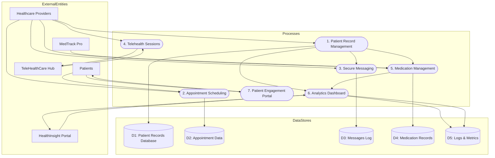

```mermaid
flowchart TD
    subgraph ExternalEntities
        A1[Healthcare Providers]
        A2[Patients]
        A3[TeleHealthCare Hub]
        A4[MedTrack Pro]
        A5[HealthInsight Portal]
    end

    subgraph Processes
        P1([1. Patient Record Management])
        P2([2. Appointment Scheduling])
        P3([3. Secure Messaging])
        P4([4. Telehealth Sessions])
        P5([5. Medication Management])
        P6([6. Analytics Dashboard])
        P7([7. Patient Engagement Portal])
    end

    subgraph DataStores
        D1[(D1: Patient Records Database)]
        D2[(D2: Appointment Data)]
        D3[(D3: Messages Log)]
        D4[(D4: Medication Records)]
        D5[(D5: Logs & Metrics)]
    end

    %% Data Flows
    A1 --> P1
    A1 --> P2
    A1 --> P3
    A1 --> P5
    A1 --> P4

    A2 --> P2
    A2 --> P7
    P7 --> A2

    P1 --> D1
    P2 --> D2
    P3 --> D3
    P5 --> D4
    P6 --> D5

    P1 --> P3
    P1 --> P5
    P1 --> P6

    P5 --> P6
    P6 --> A5

    P4 --> A3
    A4 --> P5
    P6 --> D5

    A3 --> P4
    A5 --> P6
```
